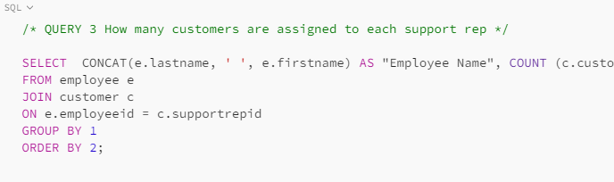

# SQL-Project
Udacity Project: Query a Digital Music Store Database

## Introduction
One of the projects in the Udacity Business Analytics Nanodegree was to query the "Chinook Database" for a music store. This project helped me demonstrate my skills in SQL, including using JOINS, COUNT,AVERAGE, SUM and other aggregations. I was able to flex my creative problem-solving skills on this project. 

### About Database
---
The Chinook database holds information about the albums, tracks and customers of a music store as well as details about the store's employees and their invoices. 

### Tool Used
---
Postgres SQL (JOINS, SUM, LIMIT, CONCAT)

### Tasks
---
For the tasks, I came up with four questions.
1. How many tracks are available per media type?
2. Which countries have the highest invoice totals?
3. How many customers are assigned to each support rep?
4. How many tracks are available per genre?

### TASK 1
---

- This query selects the "Name" column from the "mediatype" table and counts the number of tracks and stores the value in the "Number of Tracks" column
- Then the "mediatype" table is joined to the "track" table using the "mediatypeid" field
- Then the result is grouped by the "Name" column and arranged in descending order by the "Number of Tracks" column.

  

  ### TASK 2
---
  

- This SQL query retrieves the country from the "customer" table, and the "sum" of the "total" field from the invoice table.
- The "customer" and "invoice" tables are joined using the "customerid" and "invoiceid" fields.
- Then the results are grouped by country and sorted in descending order by the sum of the "total" fields.
- The LIMIT function was used to return only the first 10 results.

  
  
  ### TASK 3
---

- This query first selects the concatenation of the last name and first name of the employees, and stores that value in the "Employee Name" column.
- Then it counts the number of customers and stores the value in the "Number of Customers" column.
- Then it joins the "employee" table to the "customer" table using the "employeeid" and "supportrepid" fields.
- The query groups the results by the "Employee Name" column.
- Then the result is sorted in ascending order by the "Number of Customers" column.

### TASK 4
---

- The query first selects the "name" column from the "genre" table and counts the number of tracks in the "track" table and stores that value in the "Number of Tracks" column.
- The JOIN function joins the "genre" table to the "track" table using the "genreid" field.
- The result is grouped by the "genre" column and sorted in descending order by the "Number of Tracks" column.

  

  ---

  ### Connect with me
---

  [Linkedin](https://linkedin.com/in/chibuzor-data-analyst) 
  
[Twitter](https://twitter.com/cisco_official?t=zdocHllXoG5cV__V9h0pWg&s=09)

